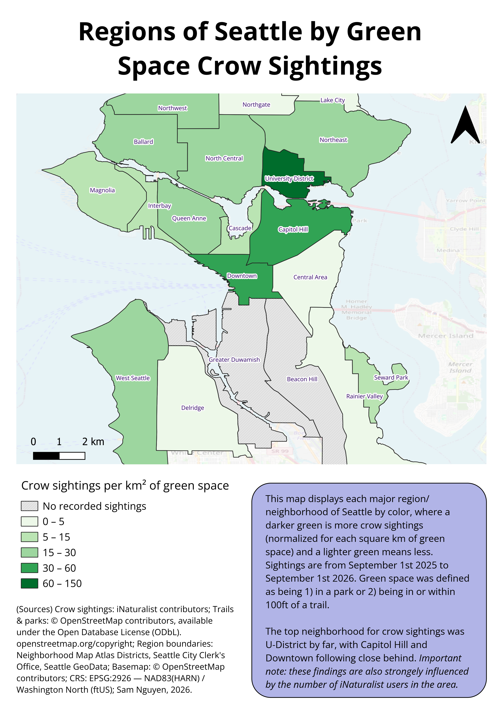
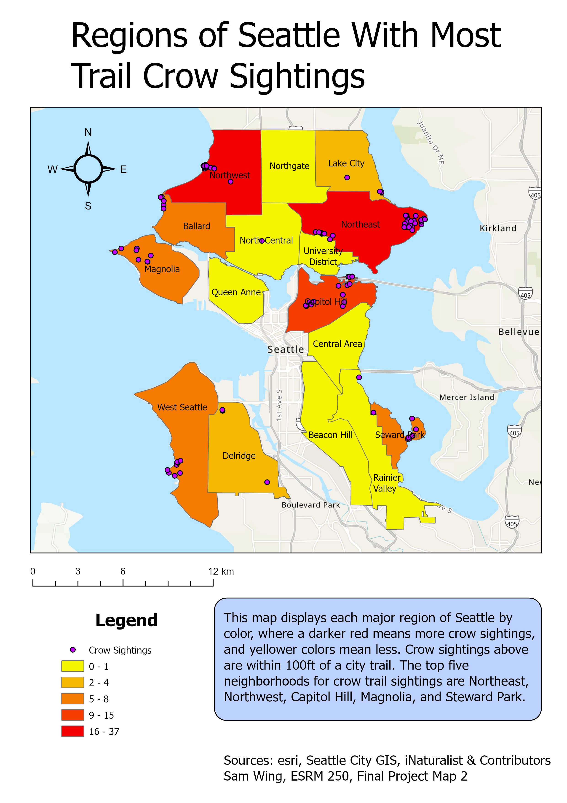

# Crow Watching Suitability in Seattle

The choropleth below displays the amount of American Crows per square km of green space in Seattle, by neighborhood. It was built in QGIS using trail/park data and iNaturalist crow observations. It is based on a ESRM 250 final project from 2025.



*New project built in 2026.*
 
**[Interactive map →](data/neighborhood_crows.geojson)**

## Question

What is the most suitable neighborhood in Seattle for crow watching?

## Data

| Source | Used for | License |
|---|---|---|
| iNaturalist contributors | American Crow observations, 1 Sep 2025 – 1 Sep 2026 | Varies by observation, see iNaturalist |
| © OpenStreetMap contributors | Trails, parks, basemap | [ODbL](https://www.openstreetmap.org/copyright) |
| Neighborhood Map Atlas Districts, Seattle City Clerk's Office, via Seattle GeoData | Neighborhood boundaries | Open data |

iNaturalist data only includes the species American Crow, (*Corvus brachyrhynchos*). Seattle was used as the area. The full data is in `data/raw/observations-780951.csv`. Most observations (1,184 total) are research grade (1,169).

The trails and parks were obtained from the OSM plugin for QGIS. The data, like iNaturalist, is crowdsourced.

**Projection:** EPSG:2926 — NAD83(HARN) / Washington North (ftUS). Calculations for distance (100ft buffer around trails) and area use this EPSG:2926 for accurate units.

**Note:** GeoJSON is reprojected to EPSG:4326 for display on Github.

## Method

1. **Initial layers loaded:** 
OSM plugin was used to bring in the trails and parks. Query was `highway=path` or `highway=cycleway` for trails. `leisure=park` was used for parks. iNaturalist data (csv file) was dropped into QGIS map.

2. **Crow Observations Layer:** 
A point layer was made using the iNaturalist latitude and longitude columns for each crow observation.

3. **Projection:** 
All layers, using the reproject tool, were converted to EPSG:2926.

4. **Green Space Layer:**
Buffer (100ft) tool was used on trails. This buffered layer and the park layer was unioned and dissolved (to erase the overlap areas). This created the green space layer.

5. **Neighborhood Boundaries:**
Intersection tool was used to divide green space into each neighborhood/region boundary. Crow observations (count points in polygon tool) were stored for each region divided by polygon area/km².

6. **Symbology:**
Manual breaks at 0, 5, 15, 30, 60, and 150. Green colors were used with higher value for more crow observations. Two neighborhoods had zero sightings and were given a hatched look.

## Result

The top three neighborhoods for per square km crow sightings were University District (145), Capitol Hill (49), and Downtown (37). The University District had almost three times the amount of Capitol Hill. Surprisingly, Beacon Hill and Greater Duwamish had zero sightings.

## Design Notes

The buffer was made 100ft because it was decided as a reasonable amount of distance that a crow can be observed from a trail in Seattle (see limitations for more information). 

Green space was used instead of total neighborhood area because green spaces are more accessible/suitable for crow watching. 

OSM data was used rather than official city layers because city layers included bike lanes on roads, which are unsuitable for crow watching. `highway=footway` was considered, but was ultimately excluded because it included sidewalks next to busy streets, which are also unsuitable for peaceful crow watching. 

In the original class project (discussed below), the University District showed no crow sightings despite being a popular spot to bird watch among students. The switch to OSM resolved this discrepancy.

## Limitations

**Bird Observation Data**
The biggest limitation was bird observation data. It is biased towards users of iNaturalist recording their sightings and willingly revealing their location. 11 observations had hidden precise coordinates, so they were estimated. Thus, this map cannot show where American Crows are truly present. This does not make the highest density crow districts any worse for bird watching, it just means that there may be other superior areas overlooked by this analysis.

Ecological based limitations include ignoring seasons and premium habitat. One entire year of observations was used with no separation by season. This would impact crow sightings because iNaturalist users would stay home more during winter and crow behavior itself would change. Premium habitat for crows was also not represented. Noise like construction would change it.

**Green Space Data**

The buffer of 100ft is merely an estimated amount of reasonable observation distance. Dense urban canopy can make this distance as low as 25ft. It does not take into consideration bird noise, which is an important part of bird watching culture and gives away crow location to observers. The data is also obtained from volunteers and is not as strictly reliable as official sources for updates or comprehensive tagging.

Smaller regions like University District and Downtown inherently have higher crows per km because of their size. Neighborhood boundaries themselves are arbitrary and not official.

## Future Improvements

- Include weighted observations by distance to trail. The cutoff of 100ft is not reasonable for every trail in Seattle. It could also take into account urban density of buildings or canopy.

- Add normalization by iNaturalist activity to eliminate bias of iNaturalist users walking in different parts of the city.

- Split by season and habitat to take into account ecological limitations mentioned above.

- Include other bird watching website data for more observations and less bias towards iNaturalist users.

## Repo contents

```
├── data/
│   ├── neighborhood_crows.geojson   final layer (EPSG:4326)
│   ├── nhoods_final.gpkg            final layer with all fields, EPSG:2926
│   ├── neighborhood_crows.qmd       layer style
│   ├── raw/                         source data unaltered
│   └── intermediate/                working layers between input and result
├── layouts/
│   └── neighborhood_crows.qpt       print layout template
├── outputs/
│   └── neighborhood_crows.png       exported map, 300 dpi
├── seattle_inatcrow_sightings.qgz   QGIS project (paths stored relative to repo)
└── README.md
```

## Tools used
- QGIS 3.44.11
- QuickOSM Plugin
- OpenStreetMap Overpass API
- iNaturalist Website

## Notes

This project is a recreation of an ArcGIS Pro final class project from the University of Washington Seattle, ESRM 250: Intro to GIS. This project aimed to add normalization, symbology improvements, and other small fixes.



*Old project from Autumn 2025.*

Project author: Sam Nguyen, September 2026